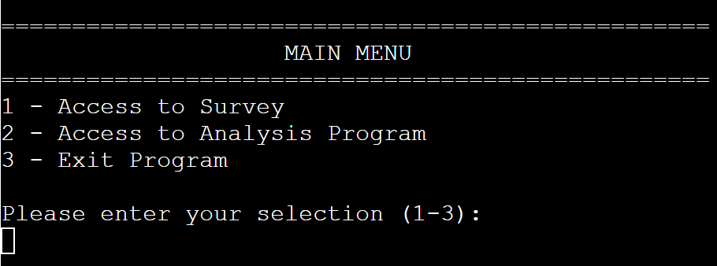
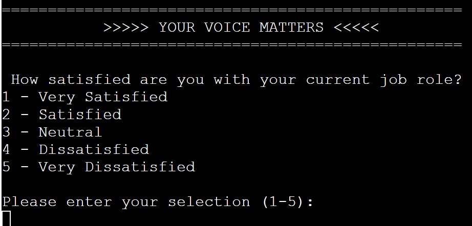
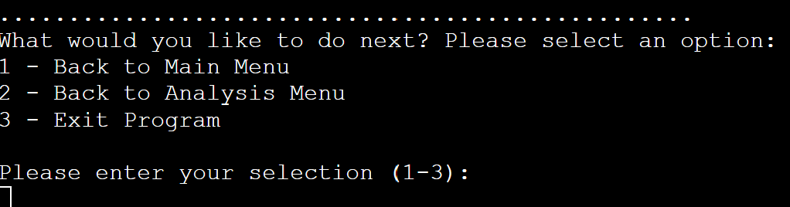
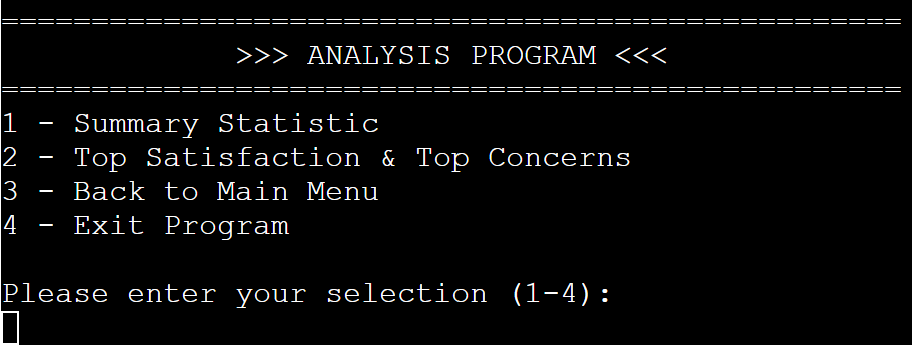
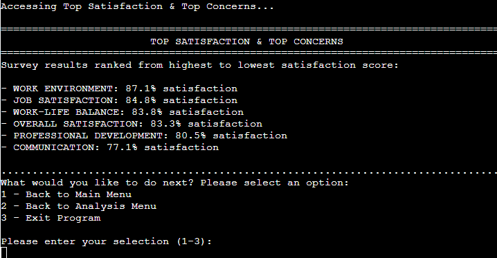

# Moodtracker - A modern Voice of the Employee tool.

The [Moodtracker](https://satisfaction-survey-sd-a479e4d4f1cf.herokuapp.com/) project was inspired by a tool already in use at *Workhuman*, the company I work for. This tool is designed to gauge employee satisfaction and provide valuable insights through survey data analysis.

This Python project is a simplified version of the *Workhuman - Moodtracker*. It provides a command-line program that serves two distinct purposes:
- To allow employees to easily participate in a satisfaction survey.
- To enable Human Ressources or management to analyse the survey data, generate key insights and identify areas for improvement.

**For Employees (Survey Respondents)**:
- As an employee, I want to easily access and complete the survey questions so that I can share my feedback on the company’s performance, culture and how I feel in my current role.

- As an employee, I want the survey process to be simple and straightforward so that I can complete it quickly without technical difficulties.

**For Human Ressources & Managers (Survey Analysis)**:
- As an HR manager, I want to collect and analyse employee responses so that I can identify trends, review the overall sentiment and identify areas of concern within the company.

- As a manager, I want to generate summary statistics and analyse top satisfaction and top concerns so I can make data-driven decisions to improve employee satisfaction.

## Features:

To define the structure of the program, I started by working with a flowchart on [Lucid](https://lucid.app/lucidchart/6696772b-e3ff-4ca0-9902-c664edc9038e/edit?invitationId=inv_e35a23e0-a2a0-4a1a-8bd6-4be77803b441&page=0_0#). The flowchart helped me visualize the overall flow of the application, including how users interact with the main menu, survey questions, and analysis options. It helped defining the logical steps from displaying the menu, collecting user input, and storing survey responses, to analyzing the data retrieved from a Google Sheets.

By using a flowchart, I wanted to ensure a smooth, logical flow of data throughout.

### Existing Features:

**Main Menu**

- *Overview*: The Main Menu serves as a starting point for navigating between different sections of the program, allowing users to easily choose between starting the survey or accessing the analysis tools.
- *Features*:
  - Clear Option Presentation: The menu presents the available options in a simple, easy-to-read format.
  - Input Validation: User inputs are validated to ensure that the selected menu options are valid. If an incorrect option is entered, the program will prompt the user to try again.
  - User Flow: The flow from the main menu to other parts of the program is intuitive, providing a seamless experience.

**Moodtracker Survey**

- *Goal*: To collect employee satisfaction levels, ensuring that employees feel heard and valued within the organisation. This tool offers a simple and engaging way for employees to provide feedback regurlarly, on different aspects of their job and work environment.
- *Features*:
  - Question Display: Employees are presented with one question at a time, allowing them to focus and provide thoughtful responses.
  - Input Validation: The program ensures that all responses are valid by checking inputs. If an invalid input is detected, users are prompted to enter a correct value.
  - User Experience: The survey design is quite simple and user-friendly, guiding employees through the process seamlessly. Prompts and clear instructions make it easy for users to navigate and complete the survey.
  - Summary: Displays user responses at the end of the survey, providing a clear overview of what will be recorded.
  - Next Action: The program presents options to move to another section.

**Analysis Program**

- *Goal*: To provide insightful data analysis from a large panel of employee responses, empowering Human Ressources and managers with actionable insights.
- *Feature*: 
  - Interactive Menu: The analysis section offers a easy-to-navigate menu with multiple options, enabling users to explore survey results in detail.
  - Input Validation: Similar to the survey section, user choices are validated. If an invalid selection is made, the program prompts the user to choose a valid option.
  - User Experience: This section has been designed to give HR professionals and managers quick access to meaningful statistics, making decision-making more informed and efficient.
  - Summary Analysis: Provides an overview of the survey results, displaying the count of responses and the percentage breakdown for each answer by question/topic.
  - Top Satisfaction and Top Concerns: Offers a sorted view, highlighting the highest satisfaction levels down to the most pressing concerns.
  - Next Action: The program presents options to move to another section.

### Features left to implement:

**Credentials requirement to access to Analysis Program**
- Since the analysis section contains confidential survey results, a credential check will be implemented to ensure only authorized personnel can access this data.

**Additional Analysis Options**
- The analysis program will be expanded to include more detailed metrics and deeper insights, providing a more comprehensive view of employee satisfaction and potential areas for improvement.

## Manual Testing:

During development, I used [Python Tutor](https://pythontutor.com/visualize.html#mode=edit) to break down and visualize small blocks of code. This tool allowed me to verify the step-by-step execution of the program, catching issues early and confirming that the logic worked as expected.

***Key Tests, Bugs and fixs:***

- **API and Google Sheets Integration**
  - *Expected*: The program retrieves data from the survey_result worksheet upon execution.
  - *Testing*: Ran run.py in the terminal.
  - *Result*: Data was retrieved and displayed as expected.

- **Main Menu Input Validation**
  - *Expected*: The program should only accept valid inputs (1, 2, or 3) and provide access to the choosen section. Invalid inputs should trigger an error message prompting the user to try again.
  - *Testing*: Ran run.py in the terminal, testing valid and invalid inputs.
  - *Result*: The program correctly processed valid inputs, allowing access to the selected section. Invalid inputs displayed an appropriate error message.

- **Main Menu Display with Class and Dictionary**
  - *Expected*: The menu options should display in correct order (1, 2, 3) along with the section names.
  - *Testing*: Ran run.py in the terminal.
  - *Result*: The options were displayed in reverse order (3 to 1).
  - *Fix*: To maintain the correct order, I replaced the set used for storing menu options with a dictionary, which preserves the insertion order.

- **Survey Display**
  - *Expected*: The program should display survey questions one at a time, allowing users to input their answers before moving to the next question.
  - *Testing*: Ran run.py in the terminal to simulate the survey.
  - *Result*: All questions were displayed simultaneously instead of one by one.
  - *Fix*: The input prompt for user answers was placed outside the loop, causing all questions to appear at once. I moved the input prompt inside the loop, ensuring each question was displayed individually, and the program waited for user input before proceeding to the next question.

- **Survey responses**
  - *Expected*: User responses should be collected and displayed in a summary to verify accuracy.
  - *Testing*: Ran run.py and submitted answers to test the response collection.
  - *Result*: Incorrect responses were displayed (e.g., "Satisfied" instead of "Very Satisfied").
  - *Fix*: The issue stemmed from zero-based indexing in the list of answers. By subtracting 1 from the user's choice, I ensured the correct answer was selected. Additionally, I noticed a variable name conflict in the final print loop (`answers` was reused), which confused the program. Renaming it to  `selected_answer` clarified the output.

- **Analysis Menu**
  - *Expected*: Displays analysis options in the correct order (1, 2, 3).
  - *Testing*: Ran run.py and checked the order of the menu display.
  - *Result*: The menu options were displayed in reverse (3 to 1).
  - *Fix*: Similar to the main menu, I switched to using a dictionary to preserve the correct order. I also corrected a prompt issue by passing the correct variable (`analysis_menu`) to the `get_user_choice` function instead of `main_menu`.

## Refactoring Process: Improving Efficiency and Readability

- **Menu Handling Logic**
  - *Before Refactoring*: Initially, I had separate functions for handling different parts of the program (like the main menu and the analysis menu). Each had its own logic to display options and get user input, which was repetitive.

  - *After Refactoring*: I created a more generic MenuOptions class that could be reused for all menus. With this in place, I only need to define the options in one place and could reuse the same functions for handling the display across multiple menus, reducing duplication.

- **Avoiding repetitions**
  -  *Before Refactoring*: Despite the MenuOptions class, I noticed that I was still repeating similar blocks of code in multiple parts of the project to display Menu titles and options. For example, both the Main menu and Analysis menu had nearly identical code for introducing the section.

  - *After Refactoring*: I created 2 generic functions to handle the display of the title, and separatly the display of the options. These functions can be reused across different sections independently.

### PEP8 validation

I used *flake8* to test the conformity of the file `run.py` according to PEP8 standards. Below are the steps I followed:
- To install the linter in *Gitpod*, I ran the following command in the terminal:
  - `pip install flake8`
- To run the linter on run.py, I used:
  - `flake8 run.py`.

Here the list of main issues raised and fixed after running flake8:
  - E302: Expected 2 blank lines, found 1
  - W293: Blank line contains whitespace
  - E231: Missing whitespace around operator
  - E501: Line too long (### > 79 characters)

Using flake8 first was beneficial because it allowed me to understand the specific formatting issues and learn the rules of PEP 8. After a few rounds of manual corrections, I found that switching to an automated tool like *Black* improved efficiency. Below are the steps I followed: 
- To install black for automatic code formatting:
  - `pip install black`
- To format the code using black on the specific file:
  - `black run.py`

### Deployment Steps

The site was deployed successfully to *Heroku* following the steps below:

1. Ensure that the `run.py` file is conform before deployment:
    - Add `\n` at the end of any inputs.
2. In *Gitpod*, create a list of dependencies in `requirements.txt` file:
    - Run `pip3 freeze > requirements.txt` in the terminal.
3. In *Heroku* account, create the new App:
    - Select `New` and `Create a new app`.
    - Name the App: `satisfaction-survey-sd` and choose a region: `Europe`Click `Create App`.
4. In the new App page, access to the `Settings` section.
5. Create a `Config Var` to access the credentials in `creds.json` file:
    - In the field `KEY` enter `CREDS`.
    - In the field `VALUE` paste the entire `creds.json` file content.
    - Click `Add`.
6. Add `Buildpacks` to install other dependancies:
    - Click `Add buildpack`.
    - Select `python` and add, then select `nodejs` and add.
7. Access to the `Deploy` section.
8. Select the deployment method:
    - Select `GitHub`
    - Search for the repository by taping the name in the search barre `PP3_Satisfaction_Survey`
    - Click on `Connect`
    - Select the option `Automatic deploys`
9. Once App deployed, the message *Your app was successfully deployed.*

The live link can be found here: [Moodtracker](https://satisfaction-survey-sd-a479e4d4f1cf.herokuapp.com/)

### Content

- Inspiration: [Workhuman](https://www.workhuman.com/)

### Credits
- The integration with *Google Sheets* was implemented using code examples from the  [Love Sandwiches Project](https://github.com/Code-Institute-Solutions/love-sandwiches-p5-sourcecode/tree/master/05-deployment/01-deployment-part-1) *Code Institute*

### External Libraries
- `gspread`: Used to interact with *Google Sheets*. This library was essential for retrieving and storing survey responses in real-time, allowing the application to dynamically update and analyze survey data directly from the Google Sheets document.
- `google.oauth2`: Used for authenticating access to *Google Sheets* via service account credentials. This library was crucial for secure and authorized access to the Google Sheets API, ensuring that only authorized users can read or write data to the survey spreadsheet.